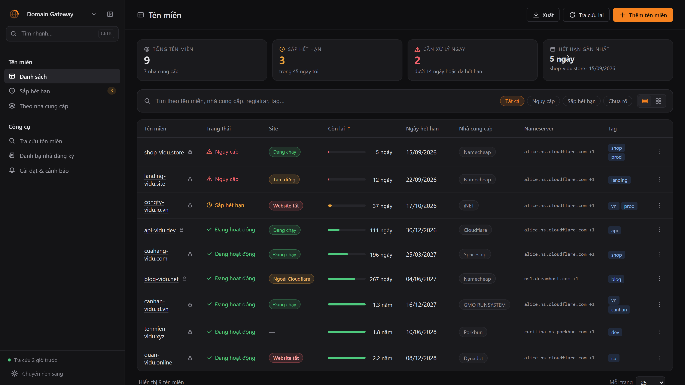
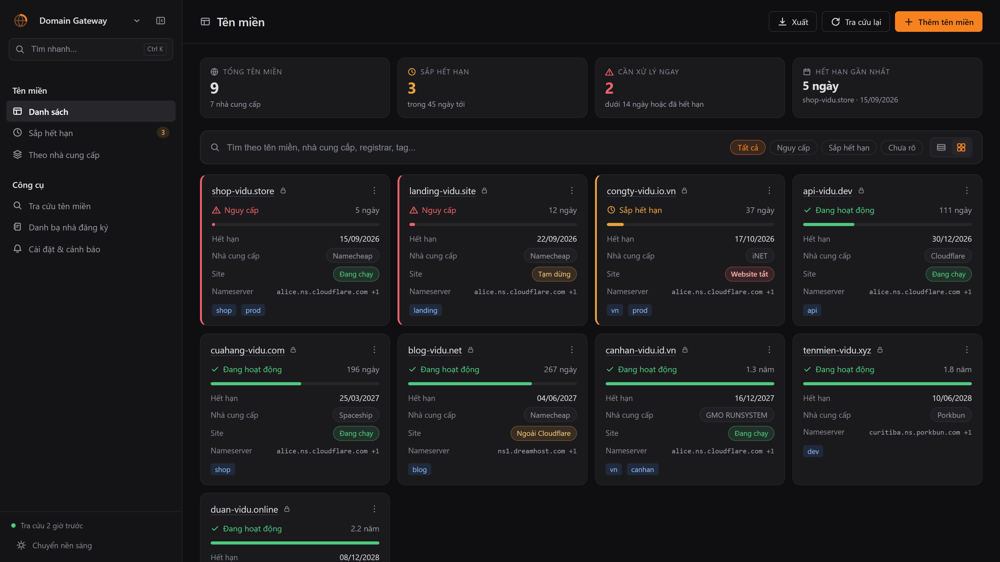
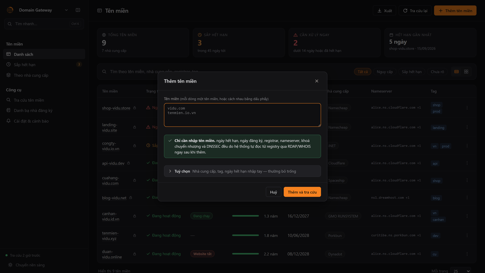
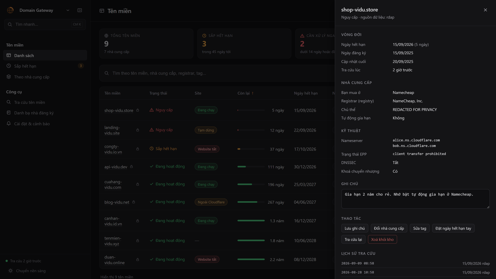
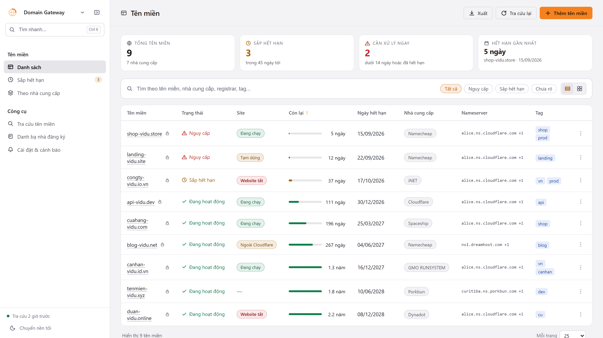
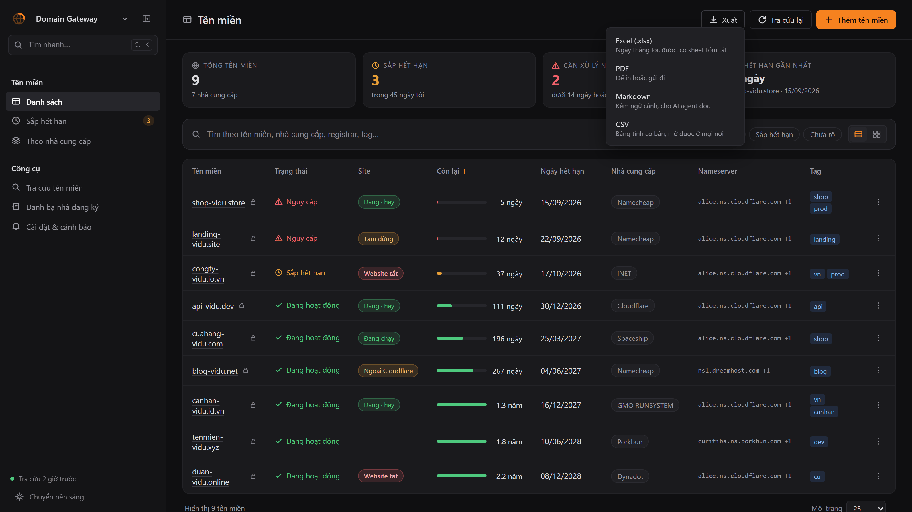
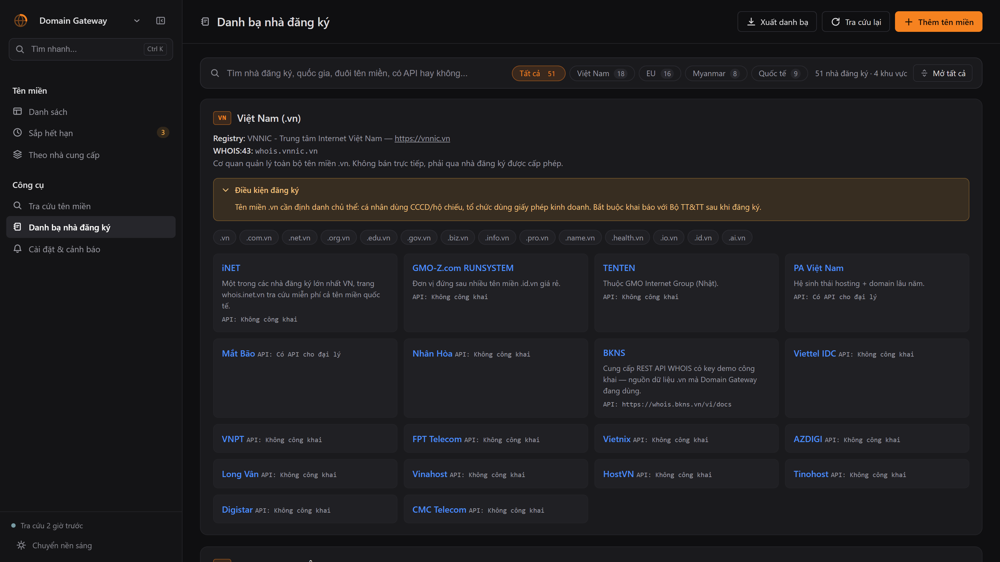
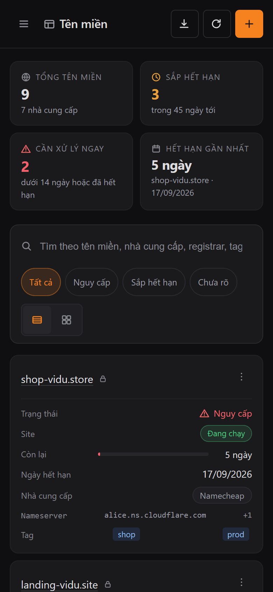
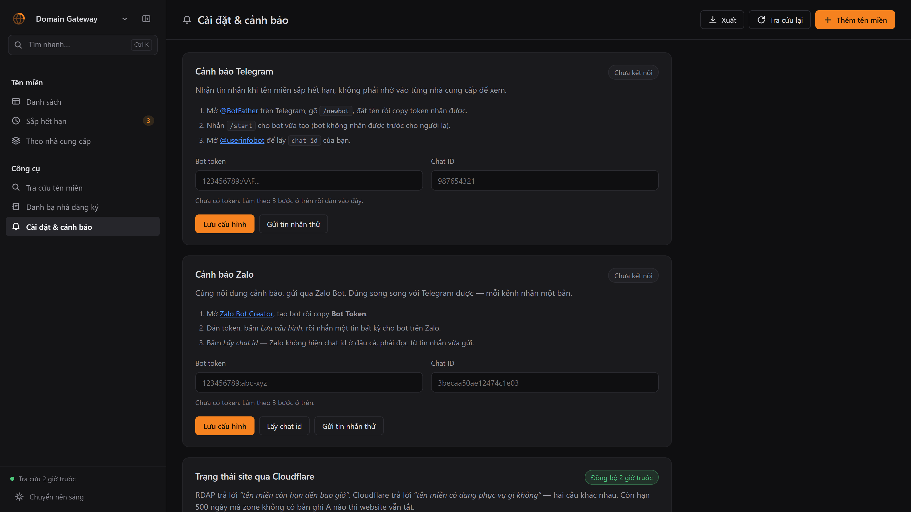

# Domain Gateway

Quản lý tập trung ngày hết hạn của **tất cả tên miền**, dù mua ở nhà cung cấp nào — trong
nước hay quốc tế. Giao diện lấy cảm hứng từ Cloudflare Dashboard.

Vấn đề nó giải quyết: mỗi nhà đăng ký một website, một tài khoản, một email nhắc hạn khác
nhau. Không có chỗ nào nhìn thấy toàn bộ. Domain Gateway đọc ngày hết hạn **thẳng từ
registry** qua RDAP/WHOIS, nên không cần API key của từng nhà cung cấp và không quan tâm bạn
mua ở đâu.



> Mọi ảnh trong README chụp từ app thật đang chạy — không phải mockup, không phải Figma.
> Dữ liệu là bộ mẫu 9 tên miền `*-vidu.*` (đã kiểm bằng RDAP: chưa ai đăng ký), vì tên
> miền thật của người dùng không phải thứ để đẩy lên repo công khai. Nạp đúng bộ đó bằng
> `python cli.py import data/domains.example.json`.

---

## Cài đặt và chạy

```bash
pip install -r requirements.txt
```

```bash
cp config.example.json config.json
```

```bash
python cli.py add tenmien-cua-ban.com
```

```bash
python cli.py refresh --all
```

> Muốn xem trước giao diện khi chưa có tên miền nào: `python cli.py import
> data/domains.example.json`. Nhưng chín tên `*-vidu.*` trong đó **chưa ai đăng ký** —
> chúng có mặt để chụp ảnh README, `refresh` sẽ trả về "không tìm thấy" cho cả chín.
> Muốn thấy dữ liệu thật thì thêm tên miền của chính bạn.

```bash
python cli.py serve
```

Mở <http://127.0.0.1:8787>.

> Tên miền quốc tế chạy được ngay: RDAP miễn phí, không cần đăng ký gì.
>
> Tên miền `.vn` cần thêm một key BKNS — VNNIC không mở RDAP/WHOIS công khai. Lấy key
> demo miễn phí ở <https://whois.bkns.vn/vi/docs> rồi điền vào `bkns_api_key` trong
> `config.json`. Key demo giới hạn 2 request/phút nên lần tra cứu đầu mất khoảng 90
> giây; các lần sau dùng cache 12 giờ nên gần như tức thì.

---

## Nguồn dữ liệu

Mỗi tên miền đi qua một chuỗi dự phòng, dừng ở nguồn đầu tiên đọc được ngày hết hạn:

| TLD | Chuỗi tra cứu |
|---|---|
| `.vn` `.io.vn` `.id.vn` `.com.vn`… | BKNS API → WHOIS:43 → RDAP |
| Còn lại | RDAP → WHOIS:43 |

- **RDAP** — chuẩn ICANN, miễn phí, không cần key. Phủ toàn bộ gTLD.
- **WHOIS:43** — dự phòng, tự hỏi `whois.iana.org` xem TLD do máy chủ nào phụ trách, tự đi
  thêm một hop tới WHOIS của registrar khi registry chỉ trả con trỏ.
- **BKNS API** — `.vn` không có RDAP công khai; BKNS nối thẳng dữ liệu VNNIC.
- **Nhập tay** — cho TLD mà registry giấu ngày hết hạn (điển hình là `.eu`). Bật cờ `pinned`
  thì giá trị nhập tay được ưu tiên tuyệt đối.

Chi tiết kỹ thuật, ví dụ curl và các bẫy khi parse: [docs/API-TRA-CUU-TEN-MIEN.md](docs/API-TRA-CUU-TEN-MIEN.md)

---

## Giao diện web

| Màn hình | Nội dung |
|---|---|
| **Danh sách** | Bảng đầy đủ: trạng thái, cột **Site**, thanh "còn lại", ngày hết hạn, nhà cung cấp, nameserver, tag |
| **Sắp hết hạn** | Lọc sẵn những tên miền dưới ngưỡng cảnh báo |
| **Theo nhà cung cấp** | Gom nhóm để thấy tên miền nào nằm ở đâu |
| **Tra cứu tên miền** | Tra bất kỳ tên miền nào mà không cần thêm vào kho |
| **Danh bạ nhà đăng ký** | 51 nhà đăng ký VN / EU / Myanmar / quốc tế kèm link API, có ô tìm kiếm |
| **Cài đặt & cảnh báo** | Kết nối Telegram và Cloudflare, chỉnh ngưỡng, xem hàng chờ cảnh báo, lấy lệnh đặt lịch |

Thao tác có sẵn: tìm kiếm, lọc theo trạng thái, sắp xếp mọi cột, xem chi tiết (drawer có
lịch sử tra cứu), sửa nhà cung cấp / tag / ghi chú / ngày hết hạn tay, tra cứu lại từng tên
miền, xuất CSV.

**Hai kiểu hiển thị.** Nút chuyển ở góc phải ô tìm kiếm:

- **Bảng** — nhiều cột, dễ so sánh ngày hết hạn giữa các tên miền.
- **Lưới** — mỗi tên miền một thẻ, tự xếp 1–4 cột theo bề rộng màn hình. Thẻ sắp hết hạn có
  viền trái màu vàng, nguy cấp màu đỏ, nhìn lướt là thấy.

Lựa chọn được nhớ trong `localStorage`, cả hai kiểu đều hỗ trợ gom nhóm theo nhà cung cấp.



**Thêm tên miền: chỉ cần gõ tên miền.** Không phải khai gì thêm. Bấm *Thêm và tra cứu* là
`_spawn_refresh()` chạy ngay ở nền, và registry trả về **ngày hết hạn, ngày đăng ký,
registrar, nameserver, trạng thái khoá chuyển nhượng, DNSSEC** — đã kiểm bằng cách gõ đúng
một dòng `iana.org`, không chạm vào ô nào khác, rồi đọc lại `/api/domains`.

Bốn ô còn lại gập vào mục *Tuỳ chọn* vì hầu như không ai phải điền. Chỉ một trong bốn cái đó
là thứ registry **không thể biết**: bạn mua tên miền ở đâu. Registrar trong dữ liệu WHOIS là
nhà đăng ký cấp registry, không phải nơi bạn quẹt thẻ — hai thứ khác nhau khi mua qua đại lý.
Hai ô ngày hết hạn nhập tay chỉ dùng khi tra cứu tự động không ra, ví dụ `.eu`.



**Ngăn chi tiết.** Bấm vào tên miền để mở: vòng đời, registrar theo registry, nameserver,
trạng thái EPP, DNSSEC, khoá chuyển nhượng, ghi chú riêng và lịch sử tra cứu.



**Sáng / tối.** Đổi bằng nút ở đáy thanh bên hoặc trong Cài đặt, có thêm lựa chọn *Theo hệ
thống*. Tương phản WCAG AA được kiểm tự động, không kiểm bằng mắt: 6 trang × 2 bề ngang ×
cả hai nền, hiện **12/12 lượt sạch**. Lần chạy đầu tiên của công cụ tìm ra 5 chỗ trượt chuẩn
mà kiểm tay đã bỏ sót — chữ đặt trên nền `--panel-3` sáng hơn nền mà token màu được chỉnh
cho, và một chỗ tô hai lớp `accent-dim` chồng nhau.



**Phân trang.** Mặc định 25 dòng/trang, đổi được sang 10 / 50 / 100 / *Tất cả* và ghi nhớ
lại. Chỉ phần đang xem mới được dựng DOM, nên danh sách vài trăm tên miền vẫn nhẹ. Đổi bộ
lọc, từ khoá hay cách sắp xếp thì tự quay về trang 1. Thanh phân trang chỉ hiện khi thực sự
có nhiều hơn một trang.

**Xuất danh sách tên miền — 4 định dạng.** Nút *Xuất* trên thanh trên cùng mở menu chọn:



| Định dạng | Dành cho | Điểm đáng nói |
|---|---|---|
| **Excel** `.xlsx` | Lọc, sắp xếp, làm báo cáo | Ngày là **kiểu date thật** nên Excel sắp xếp đúng thứ tự thời gian, không phải sắp theo chuỗi. Có freeze header, autofilter, tô màu trạng thái và sheet *Tóm tắt* kèm thống kê theo nhà cung cấp |
| **PDF** | In hoặc gửi đi | Khổ A4 ngang, tự nhúng font hệ thống (Arial/Segoe/Tahoma/DejaVu) — **font PDF lõi không có dấu tiếng Việt**, thiếu bước này là chữ vỡ hết |
| **Markdown** | **AI agent đọc** | Xem mục dưới |
| **CSV** | Mở ở mọi nơi | BOM + CRLF cho Excel Windows |

Endpoint tương ứng: `/api/export.xlsx`, `/api/export.pdf`, `/api/export.md`, `/api/export.csv`.
Markdown trả về `inline` để mở thẳng trên trình duyệt, ba định dạng còn lại tải về với tên
`domain-gateway-YYYYMMDD.<ext>`.

### Markdown cho AI agent

Không phải bảng dữ liệu trần. File gồm bốn phần, xếp theo thứ tự một agent cần đọc:

1. **Ngữ cảnh** — thời điểm xuất (agent đọc sau vài giờ vẫn biết `Còn lại` tính từ mốc nào),
   nguồn dữ liệu, ngưỡng cảnh báo đang dùng.
2. **Tóm tắt** — tổng số, số cần xử lý, số không đọc được ngày hết hạn.
3. **Cần hành động** rồi **Toàn bộ tên miền** — bảng Markdown, ô có ký tự `|` đã escape.
4. **Lưu ý nghiệp vụ** — những thứ agent sẽ kết luận sai nếu không biết: ngày hết hạn *không*
   phải ngày mất tên miền (còn grace period, redemption, pending delete), website tắt ngay khi
   hết hạn, `clientTransferProhibited` là bình thường chứ không phải sự cố, ý nghĩa từng giá
   trị của cột `Nguồn`.

Phần 4 là phần quan trọng nhất: đưa bảng số liệu trần cho một agent thì nó rất dễ kết luận
"còn 37 ngày, chưa cần lo" — trong khi thực tế `.site` gia hạn đắt gấp 15 lần nên quyết định
giữ hay bỏ phải ra trước đó khá lâu.



**Tìm và lọc trong danh bạ.** Trang *Danh bạ nhà đăng ký* có ô tìm kiếm quét tên, quốc gia,
loại hình, ghi chú, link API, đuôi tên miền và cờ trustee, cộng với dãy chip lọc theo khu
vực (Tất cả · Việt Nam · EU · Myanmar · Quốc tế).

Chip hiển thị **số kết quả theo từ khoá đang gõ**, không phải tổng cố định — gõ `trustee` thì
thấy ngay `Myanmar 5`, `EU 1`, còn `Việt Nam 0` bị làm mờ. Khu vực hết kết quả được làm mờ
chứ không ẩn, để vẫn bấm sang được. Chip dựng từ chính dữ liệu `assets/registrars.json` nên thêm
khu vực mới không phải sửa HTML.

Hai điểm đáng nói về cách so khớp:

- **Gõ không dấu vẫn ra.** `viet nam` tìm được "Việt Nam", `nhan hoa` ra "Nhân Hòa" — chuỗi
  được chuẩn hoá NFD, bỏ dấu thanh và quy `đ → d` trước khi so.
- **Hai mức khớp, xử lý khác nhau.** Khớp *danh tính* khu vực (tên, mã, đuôi tên miền,
  registry) thì mở cả nhóm — gõ `.eu` là muốn xem toàn bộ registrar bán `.eu`. Khớp *phần
  diễn giải* (điều kiện, cảnh báo) thì chỉ hiện thẻ khu vực để đọc, không mở cả danh sách,
  kèm ghi chú nói rõ. Nếu gộp hai mức làm một, gõ `trustee` sẽ báo 24 nhà đăng ký trong khi
  thực tế chỉ có 6 — con số sai lệch vì đoạn điều kiện của EU có nhắc chữ đó.

Dữ liệu danh bạ được nạp một lần rồi giữ trong bộ nhớ, nên gõ tìm kiếm và quay lại trang này
không gọi lại API.

**Đoạn điều kiện gập lại được.** *Điều kiện đăng ký* và *Lưu ý* của mỗi khu vực dài 150–240
chữ, để mở sẵn thì đẩy danh sách nhà đăng ký xuống dưới màn hình. Giờ mặc định gập còn một
dòng — nhãn cộng đoạn hé cắt bằng dấu ba chấm — bấm vào đâu trên dòng cũng mở. Cả trang gọn
lại hơn 200px ở màn hình 1030px, và càng hẹp càng tiết kiệm vì đoạn văn xuống nhiều dòng hơn.

Dùng thẻ `<details>` của trình duyệt nên có sẵn `Tab` + `Enter`/`Space` và trình đọc màn hình,
không phải tự viết ARIA. Hai điểm về trạng thái:

- **Từ khoá rơi vào đoạn nào thì đoạn đó mở sẵn** — gõ `trustee` là mở luôn ba đoạn có nhắc
  chữ đó, khỏi phải bấm từng cái để biết vì sao khu vực đó hiện lên.
- **Đóng/mở tay được nhớ lại** theo khoá `khuvuc:truong`, nên đổi chip khu vực hay vẽ lại
  danh sách không đóng sập đoạn đang đọc. Đổi từ khoá thì xoá ghi nhớ để đoạn khớp mới mở ra.

Cạnh số đếm có nút **Mở tất cả / Thu gọn tất cả**. Nút chỉ tính những đoạn **đang hiện**:
lọc riêng Myanmar thì nó ghi "Mở 2 đoạn điều kiện đang hiện", và ở khu vực không có đoạn nào
(Quốc tế) thì nút tự ẩn. Đóng tay một đoạn là nhãn quay về *Mở tất cả* ngay, vì lần bấm kế
tiếp phải mở nốt chứ không phải đóng hết.

Icon của nút bắt buộc có **vạch ngang ở giữa**. Hai mũi tên chụm/rẽ mà không có vạch thì ở
14px chúng dính vào nhau thành hình ✕ (trông như nút đóng) và hình ◇ — đã vẽ thử và phải sửa.

**Xuất danh bạ — CSV hoặc PDF.** Nút *Xuất* đổi theo trang đang mở: ở trang danh bạ nó thành
*Xuất danh bạ* và mở menu hai định dạng. Cả hai đều xuất **đúng những gì đang lọc**, không
phải toàn bộ, và tên file phản ánh phạm vi: `danh-ba-nha-dang-ky.csv`,
`danh-ba-nha-dang-ky-myanmar-loc.pdf`…

- **CSV** — 10 cột: Khu vực · Nhà đăng ký · Website · Quốc gia · Loại hình · Trustee · API ·
  Ghi chú · Đuôi tên miền khu vực · Điều kiện khu vực. Hai cột cuối lặp theo từng dòng — hơi
  thừa khi đọc bằng mắt, nhưng đó là thứ giúp lọc và xoay bảng trong Excel. Có BOM và CRLF
  theo RFC 4180 để Excel trên Windows không lỗi font tiếng Việt.
- **PDF** — khổ A4 dọc, mỗi khu vực một mục: thông tin registry, hộp *Điều kiện đăng ký*,
  danh sách đuôi tên miền, rồi bảng nhà đăng ký. Dòng đầu ghi rõ phạm vi đang lọc.

Không có kết quả nào thì báo lỗi chứ không tải về file rỗng.

**Bộ lọc chỉ có một bản, nằm ở client.** CSV dựng thẳng trong trình duyệt. PDF thì client gửi
phần **đã lọc** lên `POST /api/registrars.pdf`, server chỉ lo dàn trang chứ không lọc lại —
nếu server tự lọc thì phải viết lại logic bỏ dấu và khớp danh tính/diễn giải lần thứ hai bằng
Python, và hai bản chắc chắn sẽ lệch nhau. Cả hai đường xuất đều gọi chung `registryScope()`,
vốn dùng đúng `matchRegion()` mà phần hiển thị đang dùng.

Dữ liệu gửi lên là do trình duyệt soạn, nên server escape toàn bộ trước khi đưa vào
`Paragraph` của reportlab — thẻ này hiểu một tập cú pháp giống HTML, không escape thì một ô
chứa `<b>` sẽ làm hỏng bố cục.

| Phím tắt | Tác dụng |
|---|---|
| `Ctrl K` | Nhảy vào ô tìm kiếm (tự mở sidebar nếu đang thu gọn) |
| `Ctrl B` | Thu gọn / mở rộng sidebar — thu gọn còn 66px chỉ hiện icon, trạng thái được nhớ lại |
| `Esc` | Đóng drawer, hộp thoại hoặc menu di động |

**Giao diện sáng / tối.** Nút đổi nhanh nằm ở chân sidebar; trang *Cài đặt & cảnh báo* có bộ
chọn ba trạng thái: **Sáng**, **Tối**, **Theo hệ thống**. Mặc định là nền tối. Chọn *Theo hệ
thống* thì giao diện tự đổi ngay khi Windows chuyển sáng/tối, không cần tải lại trang.

### Responsive

Giao diện đổi hình dạng theo bề rộng màn hình, đã kiểm thử không tràn ngang ở mọi trang:

| Bề rộng | Thay đổi |
|---|---|
| > 1120px | Bố cục đầy đủ, sidebar 292px |
| ≤ 1120px | Sidebar co còn 248px, giảm khoảng đệm |
| ≤ 900px | Sidebar thành ngăn kéo trượt, mở bằng nút hamburger trên topbar. Nút thu gọn của desktop bị ẩn, ngăn kéo luôn hiện đầy đủ nhãn |
| ≤ 760px | **Bảng chuyển thành thẻ** — mỗi tên miền một khối, nhãn cột nằm bên trái, giá trị bên phải. Thống kê xếp 2 cột |
| ≤ 560px | Nút phụ chỉ còn icon (giữ `title` để hover ra chữ), tiêu đề cắt bằng dấu ba chấm, hộp thoại trượt lên từ đáy, drawer chiếm trọn màn hình |
| Màn hình cảm ứng | Vùng chạm nâng lên tối thiểu 40px: nút icon, nút thường, chip lọc, ô nhập, `select`, và tên miền trên thẻ. Nút icon phải kèm `flex: none`, không thì `width: 40px` vẫn bị flex-shrink bóp còn 30px |

**Menu bật ra phải tự nắn vào trong màn hình.** Menu neo theo mép phải của nút chủ. Ở khung
390px, nút *Xuất* nằm giữa thanh trên nên menu rộng 244px thò hẳn **60px ra ngoài mép trái**,
mất một nửa chữ. `nan_menu()` trong [app.js](static/app.js) đo lại sau khi chèn rồi dịch vào,
thay vì đóng cứng một breakpoint — nút nằm đâu trên thanh thì menu cũng vào đúng chỗ.

Đáng chú ý: lỗi này **không lộ ra qua `scrollWidth`**. Phần tử thò sang trái không sinh thanh
cuộn nào trong bố cục ltr, nên phép đo tràn ngang thông thường vẫn báo 0. Phải quét vị trí
từng phần tử mới thấy.

Bảng ngang 1247px không thể dùng trên điện thoại, nên ở khổ hẹp mỗi dòng được dựng lại
thành một thẻ bằng CSS thuần (`data-label` trên từng `<td>` làm nhãn qua `::before`) —
không cần render hai lần bằng JavaScript.



*Cùng một trang, cùng một file HTML, chỉ khác CSS.*

### Icon

Icon trong giao diện đều phải mang thông tin, không dùng để trang trí:

| Icon | Nghĩa |
|---|---|
| ✓ / ⏱ / ⚠ / ? | Bốn trạng thái vòng đời: còn hạn · đang đếm ngược · cần xử lý ngay · chưa đọc được dữ liệu |
| 🔒 | Tên miền đang khoá chuyển nhượng (`clientTransferProhibited`) |
| Bảng · Đồng hồ · Lớp · Kính lúp · Sổ · Chuông | Sáu mục điều hướng, mỗi mục một ký hiệu riêng — icon tiêu đề trang đổi theo mục đang mở |
| Quả địa cầu + cung cam | Logo: tên miền và quãng thời gian còn lại |

Icon thẻ thống kê ăn màu theo mức độ khẩn (xám → vàng → đỏ, xanh khi không còn gì phải lo).
Icon "Cần xử lý ngay" đổi hẳn hình: dấu ✓ khi bằng 0, tam giác cảnh báo khi có việc. Mọi
icon trang trí đều `aria-hidden="true"`, nút chỉ có icon đều có `aria-label`.

### Thanh cuộn

Thanh cuộn mặc định của Windows dày ~17px và sáng màu, phá nhịp giao diện tối. Đã thay bằng
thanh mảnh: ray 10px (8px ở sidebar/drawer/modal) nhưng con trượt đeo viền trong suốt cộng
`background-clip: padding-box` nên **nhìn chỉ còn 4px mà vùng bấm vẫn đủ rộng** để kéo.
Thanh cuộn ngang của bảng để trong suốt, chỉ hiện khi trỏ vào. Trên màn hình cảm ứng thì ẩn
hẳn vì hệ điều hành đã có thanh cuộn nổi.

Ba chi tiết dễ sai ở phần này:

- Dùng `background-color`, **không** dùng shorthand `background` — shorthand reset
  `background-clip` về `border-box` và xoá mất phần viền trong suốt.
- Chrome 121+ bỏ qua `::-webkit-scrollbar` nếu phần tử có `scrollbar-width` khác `auto`, nên
  phần chuẩn hoá cho Firefox nằm trong `@supports not selector(::-webkit-scrollbar)`.
- Quy tắc ẩn trên thiết bị cảm ứng phải liệt kê lại từng selector cụ thể, vì
  `.sidebar::-webkit-scrollbar` có độ ưu tiên cao hơn quy tắc chung.

Có sẵn lớp tiện ích `.no-scrollbar` khi cần ẩn hẳn mà vẫn cuộn được.

### Bảng màu

Toàn bộ màu nằm trong CSS custom properties ở `:root`, giao diện sáng chỉ ghi đè lại các
token đó trong `:root[data-theme="light"]`. Không có mã màu nào viết thẳng trong phần thân
CSS, nên thêm một chủ đề mới chỉ là thêm một khối token.

| Nhóm token | Dùng cho |
|---|---|
| `--bg` `--sidebar` `--panel` `--panel-2` `--panel-3` | Các lớp nền, từ nền trang đến nền nổi |
| `--border` `--border-soft` `--border-strong` | Đường kẻ thường, mờ, và khi hover |
| `--text` `--text-strong` `--text-dim` `--text-mute` | Bốn cấp chữ |
| `--accent` / `--accent-ink` | Màu nhấn cho mảng đặc / cho chữ (chữ cần đậm hơn để đủ tương phản trên nền trắng) |
| `--green` `--amber` `--red` `--blue` + `-dim` `-line` `-ink` | Màu trạng thái: chữ, nền mờ, viền |
| `--row-hover` `--shadow` | Nền dòng khi rê chuột, đổ bóng |

Ba điểm cần nhớ:

- **`data-theme` luôn là một giá trị cụ thể** (`dark` hoặc `light`). "Theo hệ thống" chỉ là ý
  định lưu trong `localStorage`; JavaScript quy đổi nó ra màu thật rồi mới ghi vào DOM. Nhờ
  vậy CSS không phải khai báo trùng bảng màu trong `@media (prefers-color-scheme)`.
- **Có script nội tuyến trong `<head>`** đặt `data-theme` trước khi trang được vẽ, tránh nháy
  màu (FOUC) khi tải lại ở chế độ sáng.
- **`color-scheme` được khai báo theo từng chủ đề**, nên ô nhập ngày, dropdown và thanh cuộn
  mặc định của trình duyệt cũng đổi theo.

Cả hai giao diện đã kiểm tra tương phản: 23/23 vị trí chữ chính đạt WCAG AA (≥ 4.5:1).

---

## Trạng thái site qua Cloudflare

RDAP trả lời *“tên miền còn hạn đến bao giờ”*. Cloudflare trả lời *“tên miền có đang phục vụ gì
không”* — **hai câu hỏi khác nhau**. Còn hạn 500 ngày mà zone không có bản ghi A nào thì
website vẫn tắt, và registry không bao giờ báo cho bạn biết điều đó.

Đây là lý do nguồn này được thêm vào, chứ không phải để lấy lại ngày hết hạn mà RDAP đã cho
miễn phí.

**Chỉ cần quyền đọc.** Tạo token ở [API Tokens](https://dash.cloudflare.com/profile/api-tokens)
→ *Custom token*, cấp đúng `Zone : Zone : Read` và `Zone : DNS : Read`. Không cần quyền ghi
nào — mọi hàm trong [cloudflare.py](gateway/cloudflare.py) đều là `GET`.

```bash
python cli.py cloudflare --verify
```

```bash
python cli.py cloudflare
```

Hoặc dán token vào trang *Cài đặt & cảnh báo* rồi bấm *Đồng bộ ngay*.

| Kết luận | Nghĩa là |
|---|---|
| `ok` | Zone active và có bản ghi A/AAAA/CNAME |
| **`khong-ban-ghi`** | **Zone bật nhưng không trỏ tới đâu — tên miền sống, website tắt** |
| `tam-dung` | Zone còn trong tài khoản nhưng đang bị tạm dừng — Cloudflare không đứng trước nữa |
| `khong-thay` | Không có zone này trong tài khoản Cloudflare |
| `zone-pending` | Chưa trỏ nameserver về Cloudflare xong |
| `thieu-quyen-dns` | Token có `Zone:Read` nhưng thiếu `Zone.DNS:Read` |

Chỉ **A / AAAA / CNAME** được tính là “trỏ tới đâu đó”. MX và TXT không tính: có MX mà không
có A thì nhận được mail nhưng web vẫn tắt.

**Cột `Site` trong bảng danh sách** hiện kết quả đó, đặt ngay cạnh cột `Trạng thái` có chủ ý:
một dòng đọc ra **“Đang hoạt động | Website tắt”** chính là thứ đáng thấy nhất — tên miền khoẻ
mạnh còn 1.5 năm mà site đã chết. Cột **tự ẩn khi chưa đồng bộ Cloudflare lần nào**, nên ai
không dùng Cloudflare thì bảng giữ nguyên như cũ chứ không thừa một cột toàn dấu gạch ngang.

Bấm tiêu đề cột để sắp xếp — thứ tự theo **mức độ đáng lo**, không theo bảng chữ cái: website
tắt lên đầu, chưa quét xuống cuối. Ô bảng hiện chữ ngắn (*Website tắt*), chữ đầy đủ nằm trong
`title` (*Không có bản ghi nào — website tắt*).

**Hai nguồn không ghi đè nhau.** `CF_FIELDS` trong [store.py](gateway/store.py) tách riêng khỏi
dữ liệu registry, đúng nguyên tắc đã áp cho `USER_FIELDS` — chỉ khác là lần này rào cả hai
chiều: `save_lookup` không chạm vào cột `cf_*`, và `save_cloudflare` không chạm vào cột
registry. Hai nguồn trả lời hai câu khác nhau, ghi đè nhau là mất một nửa thông tin.

**Token không lộ ra đâu cả.** Lỗi mạng bắt bằng `type(exc).__name__` chứ không phải `str(exc)`
— URL Cloudflare không chứa token nhưng thói quen này đã cứu phần Telegram một lần rồi. API
`/api/settings` chỉ trả về `cloudflare_token_set` là true/false, **không hé lộ ký tự nào**:
token Cloudflare là chuỗi đối không có phần công khai nào để khoe, khác token Telegram còn có
`bot_id`.

---

## Deploy bằng Docker

### Cách nhanh nhất: image dựng sẵn

Không cần clone, không cần Python trên máy đích:

```bash
docker run -d --name domain-gateway --restart unless-stopped -p 127.0.0.1:8787:8787 -v dg-data:/app/data ghcr.io/nguyenquocanhz/domaingateway:latest
```

Mở <http://127.0.0.1:8787>, vào **Cài đặt & cảnh báo** dán token Telegram/Cloudflare
(lưu vào volume nên còn nguyên sau khi nâng cấp image), rồi thêm tên miền từ giao diện.

Nâng cấp:

```bash
docker pull ghcr.io/nguyenquocanhz/domaingateway:latest && docker rm -f domain-gateway
```

rồi chạy lại lệnh `docker run` ở trên. Dữ liệu nằm trong volume `dg-data`, không mất.

> Image dựng cho `linux/amd64` và `linux/arm64` — chạy được cả VPS x86 lẫn Ampere,
> Graviton hay Raspberry Pi. Kéo được ẩn danh, không cần `docker login`.
>
> Mỗi lần đẩy lên `main`, CI dựng image, **chạy thật container rồi gọi `/api/summary`**
> và kiểm trang chủ render được; hỏng thì không đẩy lên registry — xem
> [`.github/workflows/docker.yml`](.github/workflows/docker.yml). Lần chạy đầu: container
> trả lời sau 2 giây.

### Tự dựng từ mã nguồn

```bash
docker compose up -d
```

Hoặc không dùng compose:

```bash
docker build -t domain-gateway . && docker run -d --name domain-gateway -p 127.0.0.1:8787:8787 -v dg-data:/app/data domain-gateway
```

Token đặt trong file `.env` cạnh `docker-compose.yml` (đã bị git bỏ qua), không viết thẳng vào
compose: `DG_TELEGRAM_TOKEN`, `DG_TELEGRAM_CHAT`, `DG_CF_TOKEN`, `DG_BKNS_KEY`. `config.py` đọc
sẵn mấy biến này nên **không cần mount `config.json` chỉ để nhét token**. Thiếu `config.json`
thì app tự lùi về `config.example.json`, chạy được ngay từ lần đầu.

### Bốn thứ trong Dockerfile là riêng của app này

**`fonts-dejavu-core`.** Xuất PDF cần font TTF thật — font lõi của PDF không có dấu tiếng Việt,
mà image `slim` thì không có font nào. Thiếu gói này là chữ trong PDF vỡ hết. Đường dẫn
`/usr/share/fonts/truetype/dejavu/` đã nằm sẵn trong `FONT_CANDIDATES`.

**`TZ=Asia/Ho_Chi_Minh`.** App hiển thị ngày theo giờ địa phương (`.astimezone()`). Container
mặc định UTC nên ngày hết hạn **lệch đúng một ngày** với người ở +7 — lỗi này đã dính một lần
khi làm giao diện, không phải lo xa.

**Đúng MỘT gunicorn worker, nhiều thread.** Không phải để tiết kiệm RAM:

- `RefreshJob` giữ trạng thái tra cứu trong bộ nhớ tiến trình, kèm khoá *mỗi lúc một job*.
  Nhiều worker là nhiều tiến trình, mỗi cái một khoá riêng → bấm *Tra cứu lại* chạy song song
  mấy lần, đốt sạch quota BKNS (key demo chỉ 2 request/phút).
- `/api/refresh/status` hỏi đúng trạng thái đó. Nhiều worker thì request hỏi có thể rơi vào
  tiến trình khác với tiến trình đang chạy job → thanh tiến độ đứng im.

Thread thì an toàn: `Store` giữ connection riêng cho từng thread qua `threading.local`.

**`DG_CONFIG` trỏ `config.json` vào volume.** `/app` do root sở hữu (vì `COPY` chạy bằng root),
còn tiến trình chạy bằng tài khoản thường — nên `save()` **không tạo nổi file `config.json.tmp`
trong `/app`**, và lưu token từ trang *Cài đặt* sẽ báo lỗi. Để trong volume thì vừa ghi được,
vừa không mất token mỗi lần dựng lại image. Bỏ biến này đi thì đường dẫn về như cũ, luồng dev
trên máy không đổi gì.

**Cổng buộc vào `127.0.0.1`.** App **không có đăng nhập** — ai gọi được cổng này đều xoá được
tên miền và đổi được cấu hình. Bỏ tiền tố `127.0.0.1:` đi là mở thẳng ra Internet. Muốn truy
cập từ xa thì đặt sau reverse proxy có xác thực, hoặc đi qua VPN/SSH tunnel.

### Chạy định kỳ

Trang *Cài đặt* sinh lệnh `schtasks` cho Windows. Trong Docker thì gọi từ cron của máy chủ:

```bash
0 8 * * * docker exec domain-gateway python cli.py refresh && docker exec domain-gateway python cli.py notify
```

**Deploy lên VPS** — cài Docker, đưa mã lên, ba cách truy cập an toàn (SSH tunnel / nginx +
Basic Auth / Tailscale), cron chạy định kỳ, sao lưu, bảng sự cố thường gặp:
[docs/DEPLOY-VPS.md](docs/DEPLOY-VPS.md)

### `gunicorn` chỉ nằm trong image

Nó **không** có trong `requirements.txt`: bản thân app không import gunicorn, và trên Windows
thì gunicorn không cài được. Dev vẫn chạy `python cli.py serve` như cũ. Werkzeug dev server
không dành cho môi trường thật, nên riêng image thì dùng gunicorn.

---

## CLI

```bash
python cli.py import data/domains.example.json     # nạp danh sách từ JSON hoặc TXT
python cli.py add example.com --provider Porkbun --tags shop,prod
python cli.py refresh                           # chỉ tra lại cái đã quá hạn cache
python cli.py refresh --all                     # ép tra lại tất cả
python cli.py list                              # bảng màu trong terminal
python cli.py list --expiring                   # chỉ cái sắp hết hạn
python cli.py list --provider namecheap         # lọc theo nhà cung cấp
python cli.py set landing-vidu.site --provider Namecheap --tags prod
python cli.py set mydomain.eu --expires 2027-03-01 --pin
python cli.py export --csv data/domains.csv --json data/domains.json
python cli.py export --md bao-cao.md --xlsx bao-cao.xlsx --pdf bao-cao.pdf
python cli.py notify --test                     # gửi tin nhắn kiểm tra kết nối
python cli.py notify --dry-run                  # xem trước nội dung, không gửi
python cli.py notify                            # gửi cảnh báo mới
python cli.py notify --force                    # gửi lại cả những cái đã báo
python cli.py notify --reset                    # xoá lịch sử chống trùng
python cli.py serve --port 9000
```

---

## Cảnh báo tự động qua Telegram

### Kết nối

1. Mở [@BotFather](https://t.me/BotFather), gõ `/newbot`, đặt tên rồi copy token.
2. Nhắn `/start` cho bot vừa tạo — Telegram không cho bot nhắn trước cho người lạ, bỏ bước
   này sẽ nhận lỗi `chat not found`.
3. Mở [@userinfobot](https://t.me/userinfobot) để lấy `chat id`.
4. Dán token và chat id vào trang **Cài đặt & cảnh báo** rồi bấm *Lưu cấu hình* →
   *Gửi tin nhắn thử*.



Không thích dùng web thì điền thẳng vào `config.json`:

```json
"notify": {
  "telegram_bot_token": "123456:ABC-DEF...",
  "telegram_chat_id": "987654321"
}
```

rồi chạy `python cli.py notify --test`.

### Chống gửi trùng

Mỗi tên miền chỉ được báo **một lần cho mỗi mức độ khẩn** (`expiring` → `critical` →
`expired`), lưu trong bảng `alerts`. Chạy cron hằng ngày sẽ không spam lại cùng một cảnh
báo. Khi bạn gia hạn xong, ngày hết hạn đổi nên khoá chống trùng cũng đổi theo và chu kỳ
cảnh báo tự đặt lại — không cần thao tác gì thêm.

Muốn gửi lại có chủ đích: `notify --force`, hoặc xoá sạch lịch sử bằng `notify --reset`.

### Đặt lịch chạy hằng ngày

Trang Cài đặt in sẵn lệnh này kèm đường dẫn thật của máy bạn và một nút sao chép — lấy ở đó
thay vì sửa tay. Chạy Command Prompt bằng quyền Administrator:

```bash
schtasks /create /tn "DomainGateway" /tr "cmd /c cd /d C:\duong\dan\toi\domain_gateway && python cli.py refresh && python cli.py notify" /sc daily /st 08:00
```

Kiểm tra: `schtasks /query /tn "DomainGateway"` · Xoá: `schtasks /delete /tn "DomainGateway" /f`

---

## Cấu hình

`config.json` (xem `config.example.json` để biết đầy đủ):

| Khoá | Mặc định | Ý nghĩa |
|---|---|---|
| `bkns_api_key` | `""` | Key API WHOIS Việt Nam — phải tự xin, chỉ cần cho tên miền `.vn` |
| `bkns_rpm` | 2 | Số request/phút tối đa tới BKNS |
| `cache_ttl_hours` | 12 | Bao lâu thì coi dữ liệu là cũ |
| `warn_days` | 30 | Ngưỡng "sắp hết hạn" |
| `critical_days` | 7 | Ngưỡng "nguy cấp" |
| `workers` | 6 | Số luồng tra cứu song song |
| `port` | 8787 | Cổng web |

Biến môi trường ghi đè file: `DG_BKNS_KEY`, `DG_CF_TOKEN`, `DG_WARN_DAYS`, `DG_CRITICAL_DAYS`,
`DG_PORT`, `DG_HOST`, `DG_TELEGRAM_TOKEN`, `DG_TELEGRAM_CHAT`.

`DG_CONFIG` đổi chỗ đặt `config.json` — mặc định nằm cạnh mã nguồn, trong Docker trỏ vào
`/app/data/config.json` để token còn nguyên sau khi dựng lại image.

---

## Giới hạn đã biết

- **`.eu` không đọc được ngày hết hạn.** EURid không công bố qua WHOIS công khai và không có
  trong bootstrap RDAP. Phải nhập tay (`--expires` + `--pin`).
- **Key demo BKNS: 2 request/phút, 200/ngày mỗi IP.** Đủ cho vài chục tên miền `.vn` nhờ
  cache, nhưng `refresh --all` liên tục sẽ hết hạn mức. Xin key partner nếu cần nhiều hơn.
- **`whois.vnnic.vn` timeout** khi gọi từ một số mạng — đó là lý do BKNS đứng trước WHOIS:43
  trong chuỗi dự phòng cho `.vn`.
- **Không có xác thực người dùng.** Chạy trên `127.0.0.1` là chính. Muốn mở ra mạng LAN thì
  tự thêm reverse proxy + auth.

---

## Ba lớp phòng thủ đáng nói

Review bảo mật 09/09/2026 tìm ra ba chỗ, đều đã vá và đều đã kiểm bằng cách tấn công thật
chứ không chỉ đọc code.

**Chặn request chéo trang.** App nghe ở `127.0.0.1`, nhưng trình duyệt vẫn gửi request từ
*mọi* trang web tới localhost được. Ba endpoint `refresh`, `notify/send`, `notify/reset`
chạy được với **request rỗng** — không cần thân JSON — nên là "simple request", không bị
CORS preflight chặn. Bất kỳ trang nào bạn mở trong lúc app chạy đều kích hoạt được: xoá lịch
sử chống trùng cảnh báo, ép gửi Telegram, đốt quota BKNS.

`before_request` trong [app.py](app.py) chặn theo header `Sec-Fetch-Site` — header này do
*chính trình duyệt* đặt, trang web không ghi đè được. Client không phải trình duyệt (`cli.py`,
curl, script) không gửi header đó nên vẫn chạy bình thường. Các endpoint còn lại (POST có
thân JSON, PATCH, DELETE) trước giờ được CORS preflight che **vô tình**, không phải nhờ có
phòng thủ.

**Rào công thức trong file xuất.** Ô bắt đầu bằng `= + - @` bị Excel và LibreOffice hiểu là
công thức và **chạy** khi mở file. Dữ liệu ở đây không phải do bạn gõ hết — tên registrar lấy
thẳng từ phản hồi WHOIS/RDAP của bên thứ ba. `rao_cong_thuc()` trong
[exporters.py](gateway/exporters.py) chèn dấu nháy đơn, dùng chung cho XLSX, CSV phía server
và `csvCell()` phía trình duyệt. Hàm chỉ đụng vào **chuỗi**: số và ngày tháng phải giữ nguyên
kiểu, biến thành chuỗi là mất đúng cái mà XLSX sinh ra để có.

**Chặn WHOIS server trỏ vào mạng nội bộ.** `fetch_whois43` lấy máy chủ kế tiếp từ dòng
`Registrar WHOIS Server:` trong *phản hồi* WHOIS trước đó — giá trị này người đăng ký tên
miền ảnh hưởng được, và cổng 43 chạy plaintext nên người đứng giữa cũng sửa được. Không chặn
thì thành ra quét cổng 43 trong mạng nội bộ từ máy bạn, rồi nội dung máy chủ nội bộ trả về
chảy tiếp vào giao diện lẫn file xuất. `_tro_vao_mang_noi_bo()` phân giải DNS trước rồi từ
chối mọi địa chỉ private/loopback/link-local; không phân giải được cũng từ chối.

Điều rút ra chung: **dữ liệu WHOIS là dữ liệu của người lạ.** Nó đẻ ra cả ba chỗ trên.

### Mấy lớp mỏng hơn

**Header bảo mật.** `after_request` đặt `X-Content-Type-Options`, `X-Frame-Options: DENY`,
`Referrer-Policy: no-referrer`, và CSP. API trả JSON nên CSP là `default-src 'none'`; trang
HTML có CSP riêng với **nonce** cho đúng một đoạn script inline (đoạn chống nhấp nháy theme
chạy trước khi vẽ trang). Dùng nonce chứ không phải `'unsafe-inline'` — chỉ đúng đoạn của
mình được chạy. Riêng `style-src` vẫn phải để `'unsafe-inline'`: thanh "còn lại" và vị trí
menu đặt qua thuộc tính `style=`, mà thuộc tính style thì nonce không với tới.

Header `Server` phải đổi ở lớp request handler, **không phải trong `after_request`** —
Werkzeug gắn header của nó ở tầng WSGI sau khi Flask xong, nên đặt trong `after_request` chỉ
sinh ra header thứ hai và client đọc thành `Werkzeug/3.1.8 Python/3.14.6, Domain Gateway`.

**Che token Telegram.** Token có dạng `<bot_id>:<35 ký tự bí mật>`. Chỉ hiện `bot_id` — phần
vốn công khai, đủ để nhận ra mình đã lưu bot nào. Cách cũ giữ 4 ký tự cuối là giữ 4 ký tự
của chính phần bí mật, không được lợi gì.

**Đi theo chuyển hướng nhưng kiểm từng chặng.** rdap.org là dịch vụ bootstrap, nó chuyển
hướng sang máy chủ RDAP của từng registry nên bắt buộc phải đi theo. Nhưng
`allow_redirects=True` nghĩa là đặt trọn niềm tin vào nó. `_get_kiem_tung_chang()` tự đi, tối
đa 5 chặng, kiểm địa chỉ trước mỗi chặng.

**WHOIS cổng 43 vẫn là plaintext** — giới hạn của giao thức từ 1982, không sửa được. Ghi ra
đây để không ai nhầm rằng đã che hết: dữ liệu đọc về không được coi là đáng tin, và đó chính
là lý do có hai lớp phòng thủ ở trên.

**`config.json` siết về `0600` ngay khi ghi.** File này giữ bot token. Umask mặc định trên
Linux/macOS thường ra `0644`, tức mọi tài khoản khác trên máy đều đọc được. `chmod` chạy trên
file `.tmp` **trước** `os.replace`, để không có khoảnh khắc nào file nằm đó với quyền rộng.
Trên Windows `chmod` chỉ bật/tắt cờ chỉ-đọc nên là no-op — không sao, đúng cho nơi cần đúng.

**Chặn thân request quá lớn.** `MAX_CONTENT_LENGTH` 1 MB, và tối đa 500 dòng mỗi lần thêm.
Không phải lo bị tấn công — CSRF đã chặn đường đó — mà vì dán nhầm cả file vào ô nhập thì kho
phình ra hàng vạn dòng, rồi refresh chạy hết quota BKNS và treo hàng giờ. Danh sách dài thì
dùng `python cli.py import`.

---

## Cấu trúc thư mục

```
domain_gateway/
├── app.py                  Flask app + REST API
├── cli.py                  Giao diện dòng lệnh
├── config.example.json     Mẫu cấu hình
├── LICENSE                 MIT
├── requirements.txt
├── Dockerfile              Image deploy (font tiếng Việt cho PDF, TZ +7, 1 worker)
├── docker-compose.yml      Volume dữ liệu + token qua .env + cổng khoá ở 127.0.0.1
├── .dockerignore           Chặn config.json và DB lọt vào image
├── .github/workflows/      CI: dựng image, chạy thử container, đẩy lên ghcr.io
├── gateway/
│   ├── models.py           DomainRecord, tính trạng thái/số ngày còn lại
│   ├── resolver.py         RDAP + BKNS + WHOIS:43 + rate limit + fallback
│   ├── notifier.py         Telegram: dựng tin nhắn HTML, gửi, chia nhỏ khi quá dài
│   ├── cloudflare.py       Đọc trạng thái zone (chỉ GET, chỉ quyền đọc)
│   ├── store.py            SQLite: kho tên miền, lịch sử, chống trùng cảnh báo
│   └── config.py           Đọc/ghi config.json + biến môi trường
├── templates/index.html
├── static/{app.css, app.js}
├── assets/
│   └── registrars.json     Danh bạ nhà đăng ký VN/EU/MM/quốc tế (đọc-chỉ, đi kèm mã)
├── data/                   Thư mục dữ liệu chạy — là VOLUME trong Docker
│   ├── domains.example.json  Danh sách mẫu để bắt đầu
│   ├── config.json         Token (git bỏ qua)
│   └── gateway.db          SQLite (tự tạo)
└── docs/
    ├── img/                Ảnh minh hoạ dùng trong README
    ├── DEPLOY-VPS.md       Hướng dẫn deploy lên VPS
    ├── API-TRA-CUU-TEN-MIEN.md
    └── NHA-DANG-KY-VN-EU-MM.md
```

**Chụp lại ảnh và kiểm giao diện.** Cả hai việc dùng chung `uiux_mcp` — một MCP server
riêng nằm ngoài repo này, không cần để chạy app. App phải đang chạy ở `127.0.0.1:8787`.

```bash
python ../uiux_mcp/server.py kichban ../uiux_mcp/kichban/domain-gateway.json
```

```bash
python ../uiux_mcp/server.py kiem http://127.0.0.1:8787/#registry --khung hep mobile
```

Bộ 9 ảnh trong README này do đúng file kịch bản đó sinh ra, chụp ở 2x rồi giảm về bảng 256
màu — gộp lại chưa tới 1,1 MB. Lệnh `kiem` đo tràn ngang, tương phản WCAG, vùng chạm và vài
thứ khác; nó chính là thứ đã tìm ra 5 chỗ chữ trượt AA và mấy vùng chạm quá nhỏ mà mắt
thường bỏ sót. Công cụ đó cần `playwright` và `pillow`, không nằm trong `requirements.txt`
của app và không cần để chạy app.

### Một điểm thiết kế đáng lưu ý

`refresh` **không bao giờ ghi đè** những gì bạn tự nhập: `provider`, `tags`, `note`,
`auto_renew`, `manual_expires_at`, `pinned`. Dữ liệu từ registry và dữ liệu của bạn nằm ở
các cột riêng biệt trong SQLite (xem `USER_FIELDS` trong `gateway/store.py`).

---

## Giấy phép

[MIT](LICENSE). Dùng, sửa, bán lại đều được — chỉ cần giữ lại thông báo bản quyền.
